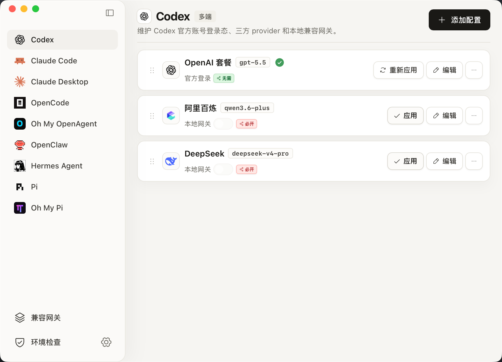
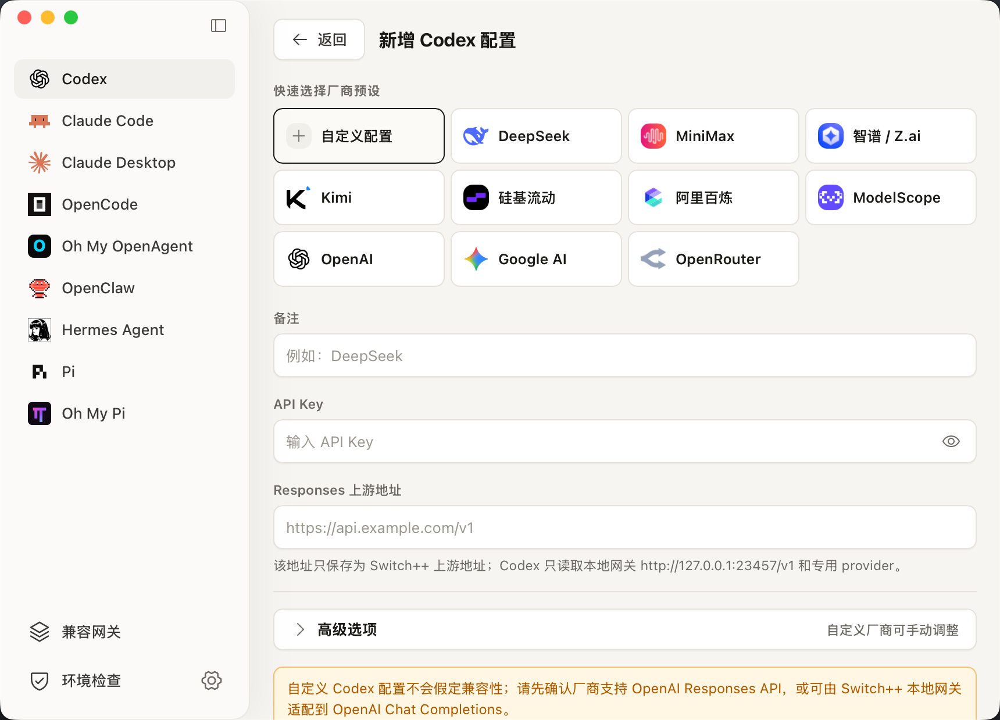
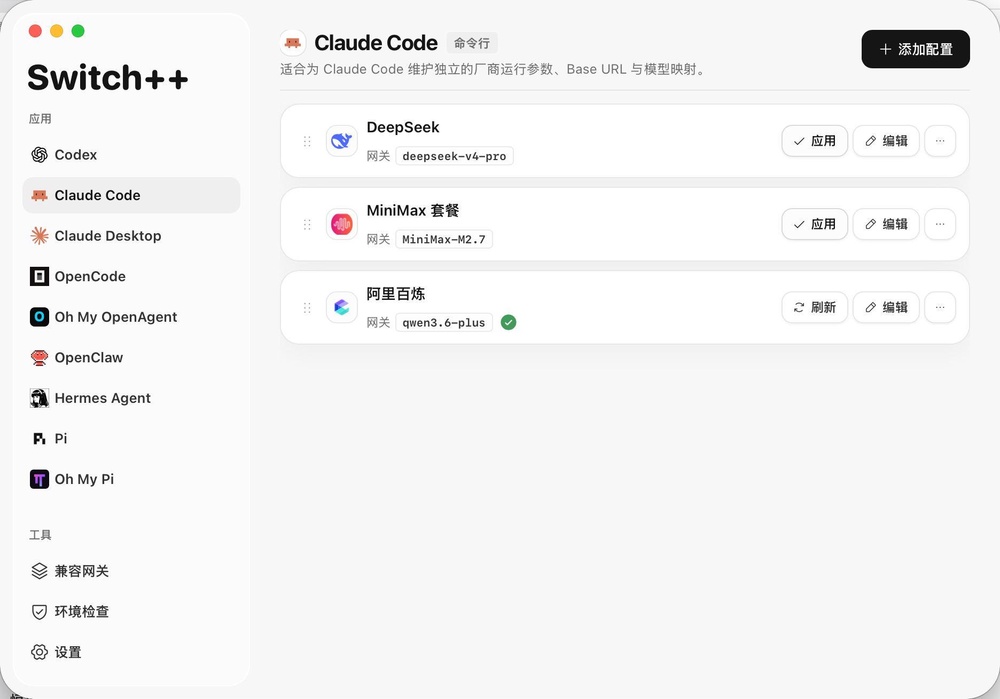
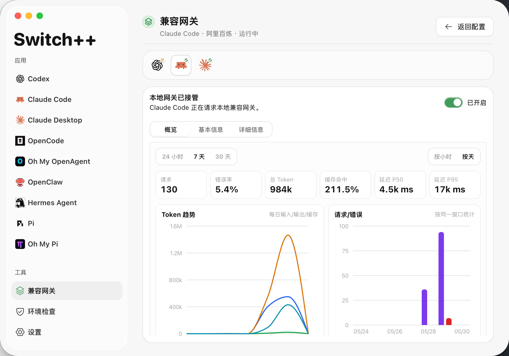
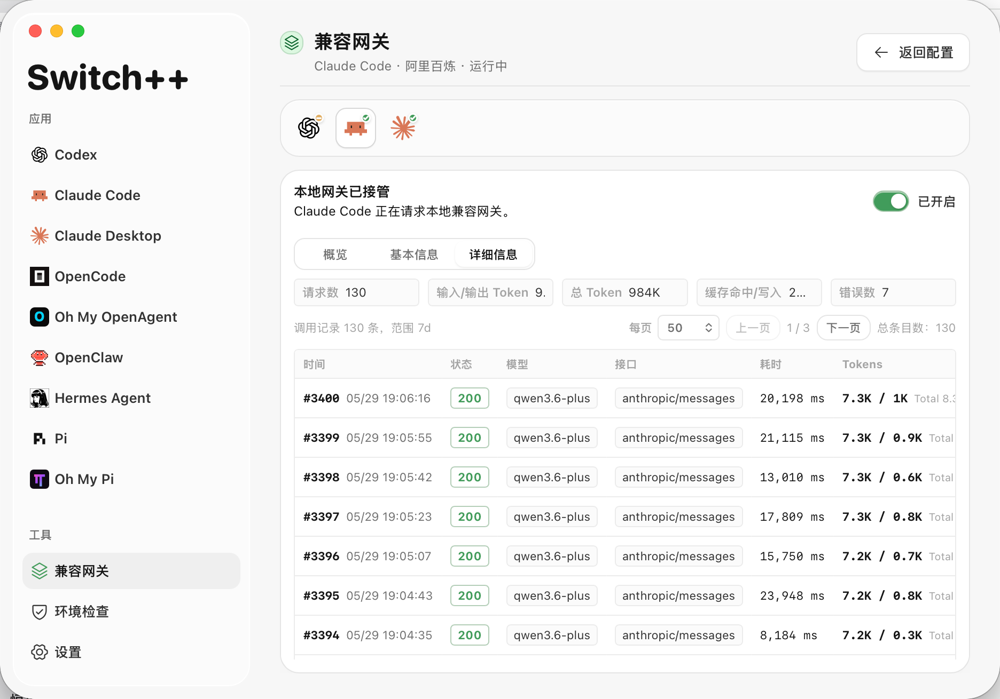
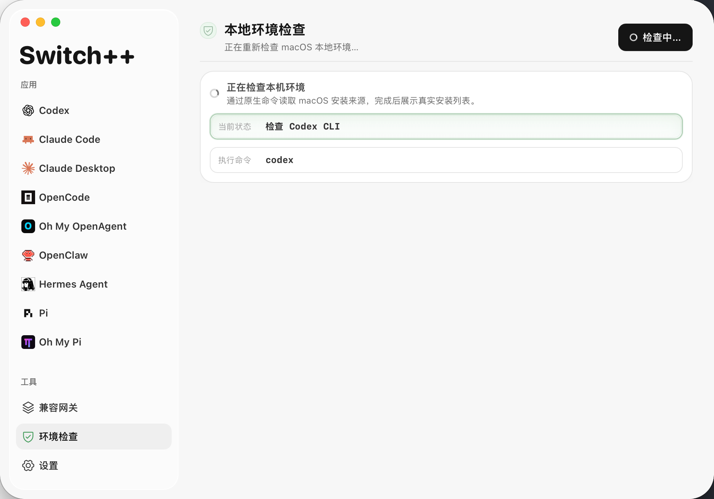

# Switch++: Third-Party Models, Profile Switching, and Local Gateway for Claude Code and Codex

中文版本: [README.md](README.md)

Switch++ is a desktop configuration switcher, model router, and local compatibility gateway for bringing third-party models into Claude Code, Claude Desktop, Codex CLI, Codex Desktop, and common local AI coding agents. It also matches common searches such as Claude Code third-party models, Codex third-party models, Codex config switching, Claude Desktop local gateway, OpenAI-compatible proxy, and Anthropic-compatible proxy.

- Downloads: https://github.com/sssstwee/switch-plus-plus/releases/latest
- Download page and user guide: https://sssstwee.github.io/switch-plus-plus/

## What It Solves

- Manage multiple Claude, Codex, and local-agent model profiles from one desktop app.
- Switch between official-account profiles and third-party provider profiles.
- Use a local compatibility gateway to bridge Anthropic, OpenAI, Responses, and Chat Completions protocol differences.
- Preview JSON / TOML before writing local config, with backups created before changes are applied.
- Inspect local gateway request history, token usage, cache hits, errors, and trend charts.
- Check local apps, CLIs, config paths, installed versions, and available upgrades.

## Who It Is For

- Developers who want to use third-party models in Claude Code, Claude Desktop, Codex CLI, or Codex Desktop.
- Users who need both official-account mode and third-party provider mode.
- Users connecting DeepSeek, MiniMax, Kimi, GLM, or other OpenAI-compatible / Anthropic-compatible models.
- Users debugging local agent request paths, config write locations, model names, or protocol adaptation issues.

## Core Features

### Profile Management

- Save multiple profiles for each target app.
- Add, edit, duplicate, delete, reorder, and apply profiles quickly.
- Use built-in provider presets, model discovery, capability notes, and configuration recommendations.
- Preview generated config before writing it, with backups created before apply.

### Local Compatibility Gateway

- Route Claude and Codex third-party model calls through one local gateway.
- Handle OpenAI-compatible, Anthropic-compatible, Responses, and Chat Completions protocol differences.
- Support model mapping, auth isolation, request records, and unified start/stop.
- Route Codex third-party models through the local Responses runtime gateway while preserving the official `auth.json`, ChatGPT login shell, plugin entry points, and mobile connection path as much as possible.

### Diagnostics and Environment Checks

- Inspect gateway status, request details, tokens, cache reads and writes, errors, and trend charts.
- Check local tools, apps, config files, installed versions, and upgrade availability.
- Install, upgrade, and uninstall common CLI tools from the app.

## Supported Target Apps

| Target app | What Switch++ manages | Main config location |
| --- | --- | --- |
| Claude Code | CLI settings, model mapping, gateway environment variables, feature flags | `~/.claude/settings.json` |
| Claude Desktop | Desktop third-party config library | macOS: `~/Library/Application Support/Claude-3p/configLibrary`; Windows: `%APPDATA%\Claude-3p\configLibrary` |
| Codex | Official login config and third-party provider config | `~/.codex/auth.json`, `~/.codex/config.toml` |
| OpenCode | OpenAI-compatible provider, default model, small model | `~/.config/opencode/opencode.json` |
| Oh My OpenAgent | agents/categories model routing, with synced OpenCode provider config | `~/.config/opencode/oh-my-openagent.json` |
| OpenClaw | provider and default agent model | `~/.openclaw/openclaw.json` |
| Hermes Agent | custom provider and default model | `~/.hermes/config.yaml` |
| Pi | custom provider, default provider, and default model | `~/.pi/agent/models.json`, `~/.pi/agent/settings.json` |
| Oh My Pi | provider and agent/category model routing | `~/.omp/agent/models.yml` |

## Screenshots

**Codex profiles**



**New Codex profile**



**Claude Code profiles**



**Gateway overview**



**Gateway request history**



**Environment check**



## Download and Install

Open the release page and choose the installer for your system:

- macOS Apple Silicon: `aarch64.dmg`
- macOS Intel: `x64.dmg`
- Windows x64: `x64-setup.exe`
- Linux x64: `amd64.AppImage`

The available assets are determined by the release page.

## First Launch on macOS

If macOS says it cannot verify the developer, first confirm that the installer came from this repository's release page, then try:

1. Open Applications in Finder.
2. Control-click `Switch++.app`.
3. Choose Open, then confirm Open in the system prompt.

If the app is still blocked by a quarantine flag, run:

```bash
sudo xattr -rd com.apple.quarantine "/Applications/Switch++.app"
open "/Applications/Switch++.app"
```

If macOS still blocks the app, go to System Settings > Privacy & Security and click Open Anyway next to the Switch++ warning.

## Basic Workflow

1. Download and install Switch++.
2. Open the app and run Environment Check first.
3. Select Claude Code, Claude Desktop, Codex, or Compatibility Gateway.
4. Add a new profile or sync the current local profile.
5. Review the generated local configuration.
6. Click Apply to write the configuration.
7. If the target app only reads config at startup, restart the target app or open a new terminal session.

## When Changes Take Effect

- Switch++ writes local configuration files for the current user.
- Already-running terminal sessions or desktop apps may still hold old configuration.
- If changes do not take effect immediately, open a new terminal session or restart the target app.
- After switching to a third-party provider profile, confirm that the target app is using the expected request endpoint and model name.

## Safety Notes

- Switch++ writes only local configuration files for the current user.
- Applying a profile changes the request target for Claude Code, Claude Desktop, or Codex.
- Review API Base URL, model name, and API Key before writing.
- Keep API Keys private and avoid sharing screenshots that contain secrets.
- To roll back, use a Switch++ backup or sync the current target app configuration again.

## FAQ

### Why does my current terminal not change after applying a profile?

Some command-line tools read environment variables or config files only at startup. Close the current terminal window, open a new one, and test again.

### Can I keep official-account and third-party profiles at the same time?

Yes. Switch++ can save multiple profiles and switch between them. After switching, restart or open a new session as required by the target app.

### Why is Environment Check needed?

Environment Check confirms target apps, command paths, and config file locations before writing changes, reducing the chance of writing to the wrong place.

### Why is there no Claude Desktop check on Linux?

When no Claude Desktop target is available on the system, Switch++ skips desktop checks and handles the available Claude Code and Codex configuration only.

## Search Keywords

Switch++, Switch Plus Plus, switchpp, switch-plus-plus, cc3p, Claude Code third-party models, Claude Code config switching, Claude Code gateway, Claude Desktop third-party models, Codex third-party models, Codex CLI, Codex Desktop, Codex config switching, Codex local gateway, Agent Router, model router, model switcher, LLM gateway, Hermes, OpenCode, OpenClaw, Pi, DeepSeek Codex, Kimi Codex, MiniMax Claude Code, GLM Codex, OpenAI-compatible, Anthropic-compatible, local compatibility gateway.

## Copyright and License

Copyright (c) 2026 sssstwee.

This project is licensed under the custom Switch++ Proprietary Non-Commercial Source License 1.0. This is not an OSI open-source license. The source code may be viewed, run, and modified only for personal, educational, research, or evaluation purposes. Without prior written permission, commercial use, internal company use, SaaS or hosted service use, paid delivery, commercial project integration, publication of modified or derivative versions, and use for machine learning training, datasets, evaluation, or automated development tools are strictly prohibited.

See [LICENSE](LICENSE) for the full terms.
