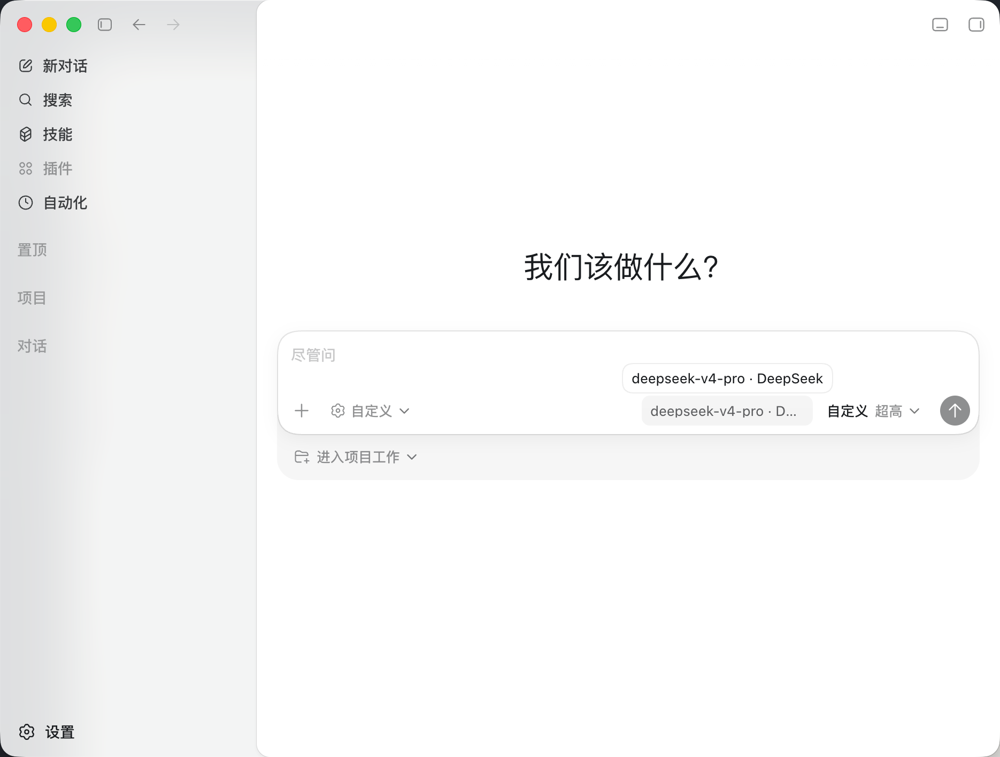
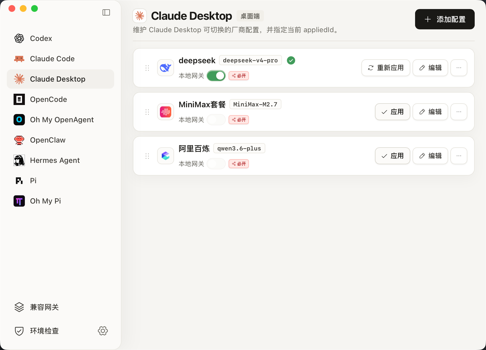
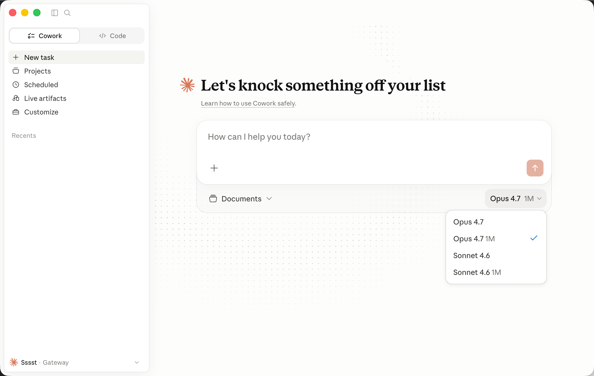
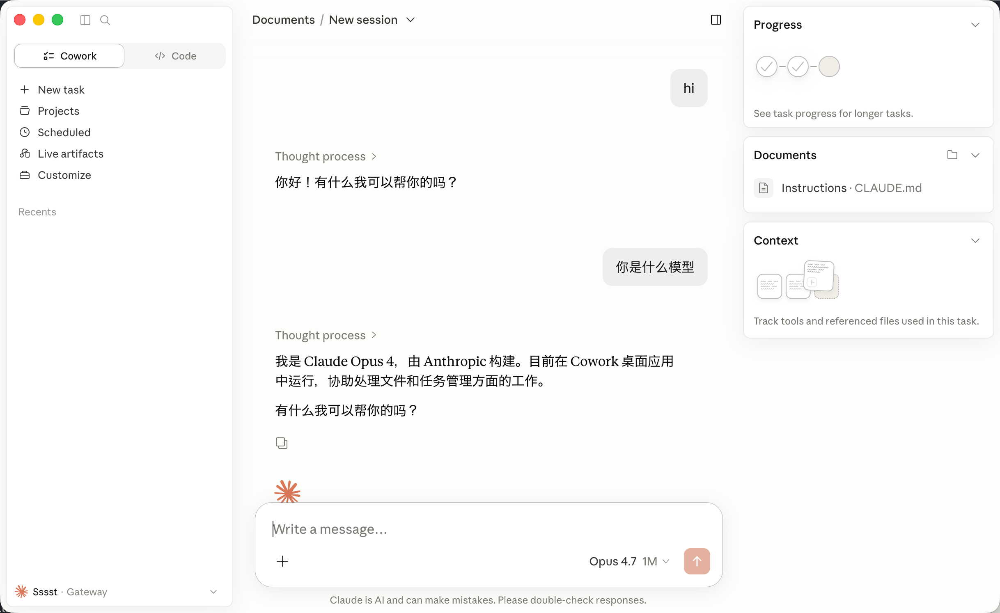

# Switch++: Third-Party Models for Claude & Codex

语言 / Language: [中文](#中文) | [English](#english)

## 中文

**中文名：** Switch++

**英文名：** Switch++

Switch++ 是一个桌面端三方接入与配置切换工具、模型路由器和本地兼容网关，用于统一管理 Claude Code、Claude Desktop、Codex CLI、Codex Desktop、Hermes Agent、OpenCode、OpenClaw、Pi、Oh My OpenAgent、Oh My OpenCode、Oh My Pi 等热门智能体和 AI coding agent 的官方账号模式、第三方模型厂商配置、OpenAI API 兼容端点、Anthropic API 兼容端点，以及本地 OpenAI/Anthropic compatibility gateway。它面向需要让第三方模型进入 Claude、Codex 和本地 AI 编程工具的开发者。

- 下载地址：https://github.com/sssstwee/switch-plus-plus/releases/latest
- 下载页与使用指南：https://sssstwee.github.io/switch-plus-plus/
- English: [Jump to English](#english)

### GitHub 搜索关键词

Switch++, Agent Router, model router, model switcher, LLM gateway, Claude Code third-party models, Claude Desktop, Codex third-party models, Codex CLI, Codex Desktop, Hermes, Hermes Agent, OpenCode, OpenClaw, Pi, Pi Coding Agent, Oh My OpenAgent, Oh My OpenCode, Oh My Pi, OpenAI, OpenAI API, Anthropic, Anthropic API, third-party config switcher, third-party config manager, AI coding agent, local compatibility gateway, OpenAI API proxy, Anthropic API proxy, OpenAI-compatible, Anthropic-compatible, model provider switcher.

### 功能亮点

- 让第三方模型稳定进入 Claude Code、Claude Desktop、Codex CLI、Codex Desktop 以及常用本地 AI 编程工具。
- 支持 DeepSeek、MiniMax、Kimi、GLM 等国产模型接入 Codex 客户端及 Claude 客户端，并提供本地协议适配路径。
- 支持国产模型接入 Codex 后配合使用官方插件和移动端能力；需先登录官方账号并添加官方配置，再与三方模型配置搭配使用。
- 在官方账号模式和第三方模型厂商模式之间快速切换。
- 为不同工具保存多套配置，并支持新增、编辑、复制、删除、排序和一键应用。
- 写入前预览配置内容，并在应用前自动保留备份，便于回退。
- 内置主流厂商预设、模型发现、能力提示和配置建议，减少手动试错。
- 提供本地兼容网关，统一承接 Claude 与 Codex 的第三方模型调用，并处理 Anthropic / OpenAI / Responses / Chat Completions 之间的协议差异。
- 展示网关状态、调用记录、消耗统计、缓存读写、错误记录和趋势图表，方便定位问题。
- 检查本机工具、应用、配置文件、安装版本和可升级状态。
- 支持一键安装、升级、卸载常用 CLI 工具。
- 支持中英双语界面、紧凑侧边栏、系统托盘和桌面原生窗口体验。

### 为什么选择 Switch++

Switch++ 不只是一个 provider 切换器，而是面向 Claude / Codex 桌面与本地 agent 生态的三方模型接入控制台：

- **Claude Desktop 深度适配**：管理桌面端第三方配置库，让 Claude Desktop 可以通过本地网关、官方模型名映射和厂商真实模型转发使用第三方模型。
- **Codex Desktop 官方登录态隔离**：三方模型写入专用 `agent-switch` provider，尽量保留官方 `auth.json`、ChatGPT 登录壳、插件入口和移动端连接能力。
- **本地兼容网关**：当目标应用与上游厂商协议不一致时，由 Switch++ 负责协议适配、模型映射、认证隔离、请求记录和统一启停。
- **可诊断的请求链路**：请求详情、token、缓存命中、缓存创建、错误记录和趋势图都在本机可见，方便判断是账号、模型、协议还是网关问题。
- **写入前可审计**：生成的 JSON / TOML 配置会先预览，推荐选项以勾选框呈现，并在应用前创建备份，降低误写配置的风险。
- **本地 agent 工具链管理**：覆盖 Claude Code、Claude Desktop、Codex、Hermes、OpenCode、OpenClaw、Pi、Oh My OpenAgent、Oh My Pi 等常见本地 agent 入口。

### 界面预览 / Screenshots

**Codex Desktop 使用 DeepSeek 三方模型 / Codex Desktop with a DeepSeek third-party model**



| Codex 配置列表 / Codex profiles | 新增 Codex 配置 / New Codex profile |
| --- | --- |
|  |  |

| Claude Desktop 配置切换 / Claude Desktop profiles | 本地环境检查 / Environment check |
| --- | --- |
|  |  |

| 兼容网关概览 / Gateway overview | 兼容网关调用记录 / Gateway request history |
| --- | --- |
|  |  |

| Claude Desktop 模型菜单 / Claude Desktop model menu | Claude Desktop 经由本地网关响应 / Claude Desktop through local gateway |
| --- | --- |
|  |  |

### 适用场景

- 在一个桌面应用里管理 Claude Code、Claude Desktop、Codex CLI、Codex Desktop、Hermes、OpenCode、OpenClaw 和 Pi 生态配置。
- 在官方账号模式和第三方模型厂商模式之间切换。
- 通过本地兼容网关查看实时调用记录、token 统计和缓存命中统计。
- Codex 三方模型可通过本地 Responses runtime gateway 实时路由，同时保留 ChatGPT 官方登录态，继续服务 Codex Desktop、移动端连接和插件入口。
- 写回本地配置前检查配置内容，并优先创建备份。
- 为 Codex 配置 OpenAI-compatible 第三方模型接入。
- 根据厂商能力控制配置项，例如 thinking 输出处理、Codex TOML 选项、Claude JSON 选项。
- 在应用配置前检查本机环境、命令路径和配置文件位置。

### 支持的目标应用

| 目标应用 | Switch++ 管理内容 | 主要配置位置 |
| --- | --- | --- |
| Claude Code | CLI settings、模型映射、网关环境变量、功能开关 | `~/.claude/settings.json` |
| Claude Desktop | 桌面端第三方配置库 | macOS: `~/Library/Application Support/Claude-3p/configLibrary`; Windows: `%APPDATA%\Claude-3p\configLibrary` |
| Codex | 官方登录配置和第三方厂商配置 | `~/.codex/auth.json`, `~/.codex/config.toml` |
| OpenCode | OpenAI-compatible provider、默认模型、small model | `~/.config/opencode/opencode.json` |
| Oh My OpenAgent | agents/categories 模型路由，并同步 OpenCode provider | `~/.config/opencode/oh-my-openagent.json` |
| OpenClaw | provider 与默认 agent 模型 | `~/.openclaw/openclaw.json` |
| Hermes Agent | custom provider 与默认模型 | `~/.hermes/config.yaml` |
| Pi | custom provider、默认 provider 与默认模型 | `~/.pi/agent/models.json`, `~/.pi/agent/settings.json` |
| Oh My Pi | provider 与 agent/category 模型路由 | `~/.omp/agent/models.yml` |

### 下载与安装

打开发布页，按系统选择安装包：

- macOS Apple Silicon：`aarch64.dmg`
- macOS Intel：`x64.dmg`
- Windows x64：`x64-setup.exe`
- Linux x64：`amd64.AppImage`

下载后按系统默认方式安装或打开。具体可用安装包以发布页实际显示为准。

### macOS 首次启动授权

如果 macOS 提示 Switch++ 不是来自 App Store 或无法验证开发者，先确认系统允许打开非 App Store 应用：

1. 打开「系统设置」。
2. 进入「隐私与安全性」。
3. 找到「安全性」。
4. 在「允许以下来源的应用程序」里选择「任何来源」。

如果没有看到「任何来源」，可以在终端执行下面的命令启用该选项：

```bash
sudo spctl --master-disable
```

然后回到「系统设置」>「隐私与安全性」>「安全性」，确认「任何来源」已经可选并已启用。

首次安装后，macOS 还可能因为下载文件带有 quarantine 标记而阻止启动。确认安装包来自本仓库发布页后，执行：

```bash
sudo xattr -rd com.apple.quarantine "/Applications/Switch++.app"
open "/Applications/Switch++.app"
```

如果仍然提示无法打开，请再回到「隐私与安全性」页面，在 Switch++ 提示项旁点击「仍要打开」，然后重新启动应用。

Switch++ 可以正常打开后，如需恢复 macOS 默认安全设置，可执行：

```bash
sudo spctl --master-enable
```

### 基本使用流程

1. 从发布页下载安装 Switch++。
2. 打开应用，先运行「环境检查」。
3. 选择 Claude Code、Claude Desktop、Codex 或兼容网关。
4. 添加新配置，或同步当前本地配置。
5. 检查 Switch++ 生成的本地配置内容。
6. 点击「应用」写入配置。
7. 如果目标应用只在启动时读取配置，请重启目标应用或打开新的终端会话。

### 环境检查

Switch++ 会根据当前系统检查对应路径和工具：

- macOS：检查 shell PATH、Homebrew、常见 Node 管理器、`/Applications/Claude.app`、`~/Library/Application Support`、`~/.claude`、`~/.codex`。
- Windows：检查 Windows PATH、npm/pnpm/Volta/Bun 常见目录、`%LOCALAPPDATA%`、`%APPDATA%`、`%USERPROFILE%\.claude`、`%USERPROFILE%\.codex`。
- Linux：检查 shell PATH、常见 Node 管理器、`~/.claude`、`~/.codex`。没有可用 Claude Desktop 桌面目标时会跳过桌面端检查。

### 配置生效说明

- Switch++ 写入的是当前用户本机配置文件。
- 已经运行的终端会话或桌面应用可能仍保留旧配置。
- 应用配置后，如果没有立即生效，请新开终端会话或重启目标应用。
- 切换到第三方模型厂商配置后，请确认目标应用的请求目标和模型名称符合预期。

### 安全说明

- Switch++ 只写入当前用户的本地配置文件。
- 应用配置会改变 Claude Code、Claude Desktop 或 Codex 的请求目标。
- 写入前请检查配置内容，特别是 API Base URL、模型名称和 API Key。
- API Key 请自行妥善保存，不要分享包含密钥的截图。
- 如需回退，请使用 Switch++ 创建的备份或重新同步目标应用当前配置。

### 常见问题

#### 应用后为什么当前终端没有变化？

部分命令行工具只在启动时读取环境变量或配置文件。请关闭当前终端窗口，重新打开一个新终端后再测试。

#### 可以同时保留官方账号和第三方模型配置吗？

可以。Switch++ 支持保存多个配置，并在需要时切换。切换后请按目标应用要求重启或新开会话。

#### 为什么需要环境检查？

环境检查用于确认目标应用、命令路径和配置文件位置是否存在，避免把配置写到错误位置。

#### Linux 上为什么没有 Claude Desktop 检查？

当系统没有可用的 Claude Desktop 桌面目标时，Switch++ 会跳过桌面端检查，只处理可用的 Claude Code 和 Codex 配置。

### 版权与许可

Copyright (c) 2026 sssstwee.

本项目采用自定义的 Switch++ Proprietary Non-Commercial Source License 1.0。这不是 OSI 定义的开源协议；源码仅允许个人、教育、研究或评估用途查看、运行和修改。未经书面许可，严格禁止商业使用、企业内部使用、SaaS/托管服务、付费交付、商业项目集成、发布修改版或衍生版本，以及用于机器学习训练、数据集、评测或自动化开发工具。

完整条款见 [LICENSE](LICENSE)。

## English

**Chinese name:** Switch++

**English name:** Switch++

Switch++ is a third-party config switcher, model router, and local compatibility gateway for Claude Code, Claude Desktop, Codex CLI, Codex Desktop, Hermes Agent, OpenCode, OpenClaw, Pi, Oh My OpenAgent, Oh My OpenCode, Oh My Pi, and related AI coding agents. It manages official-account mode, third-party model provider profiles, OpenAI-compatible endpoints, Anthropic-compatible endpoints, and the local OpenAI/Anthropic gateway from one desktop app.

- Downloads: https://github.com/sssstwee/switch-plus-plus/releases/latest
- Download page and user guide: https://sssstwee.github.io/switch-plus-plus/
- 中文: [跳转到中文](#中文)

### GitHub Search Keywords

Switch++, Agent Router, model router, model switcher, LLM gateway, Claude Code third-party models, Claude Desktop, Codex third-party models, Codex CLI, Codex Desktop, Hermes, Hermes Agent, OpenCode, OpenClaw, Pi, Pi Coding Agent, Oh My OpenAgent, Oh My OpenCode, Oh My Pi, OpenAI, OpenAI API, Anthropic, Anthropic API, third-party config switcher, third-party config manager, AI coding agent, local compatibility gateway, OpenAI API proxy, Anthropic API proxy, OpenAI-compatible, Anthropic-compatible, model provider switcher.

### Highlights

- Bring third-party models into Claude Code, Claude Desktop, Codex CLI, Codex Desktop, and common local AI coding tools.
- Connect domestic model providers such as DeepSeek, MiniMax, Kimi, and GLM to Codex and Claude clients through local protocol adaptation when needed.
- Use official Codex plugins and mobile features alongside domestic model profiles after signing in with an official account and adding the official configuration.
- Switch quickly between official-account mode and third-party provider mode.
- Save multiple profiles per tool, then add, edit, duplicate, delete, reorder, and apply them quickly.
- Preview local configuration before writing it, with backups created before changes are applied.
- Use built-in provider presets, model discovery, capability notes, and recommendations to reduce trial and error.
- Route Claude and Codex third-party model calls through the local compatibility gateway, including Anthropic / OpenAI / Responses / Chat Completions protocol differences.
- Inspect gateway status, request history, usage statistics, cache reads, cache creation, recent errors, and trend charts.
- Check local tools, apps, config files, installed versions, and available upgrades.
- Install, upgrade, and uninstall common CLI tools from the app.
- Use the bilingual desktop interface with compact navigation, tray support, and native window behavior.

### Why Switch++

Switch++ is not just a provider switcher. It is a third-party model access console for Claude / Codex desktop workflows and local agent toolchains:

- **Claude Desktop first-class support**: manage the desktop third-party config library, route Claude Desktop through the local gateway, and map official Claude model names to real provider models.
- **Codex Desktop with official-login isolation**: write third-party models to a dedicated `agent-switch` provider while preserving the official `auth.json`, ChatGPT login shell, plugin entry points, and mobile connection path as much as possible.
- **Local compatibility gateway**: when a target app and upstream provider speak different protocols, Switch++ handles protocol adaptation, model mapping, auth isolation, request records, and unified start/stop.
- **Diagnosable request path**: request details, tokens, cache hits, cache creation, errors, and trend charts stay visible locally, making it easier to identify account, model, protocol, or gateway issues.
- **Auditable writes**: generated JSON / TOML is previewed before writing, recommended options are exposed as checkboxes, and backups are created before applying changes.
- **Local agent toolchain management**: cover Claude Code, Claude Desktop, Codex, Hermes, OpenCode, OpenClaw, Pi, Oh My OpenAgent, Oh My Pi, and other local agent entry points.

### Use Cases

- Manage Claude Code, Claude Desktop, Codex CLI, Codex Desktop, Hermes, OpenCode, OpenClaw, and Pi-family configuration in one desktop app.
- Switch between official-account mode and third-party model provider mode.
- Inspect local compatibility gateway calls, token totals, and cache-hit statistics.
- Route Codex third-party models through the local Responses runtime gateway while preserving the official ChatGPT login shell used by Codex Desktop, mobile access, and plugin entry points.
- Review generated local configuration before writing it, with backups created first.
- Configure OpenAI-compatible third-party model providers for Codex.
- Control provider-specific options such as thinking output handling, Codex TOML options, and Claude JSON options.
- Check local command paths, config file locations, and target app availability before applying changes.

### Supported Target Apps

| Target app | What Switch++ manages | Main config location |
| --- | --- | --- |
| Claude Code | CLI settings, model mapping, gateway environment variables, feature flags | `~/.claude/settings.json` |
| Claude Desktop | Desktop third-party config library | macOS: `~/Library/Application Support/Claude-3p/configLibrary`; Windows: `%APPDATA%\Claude-3p\configLibrary` |
| Codex | Official login config and third-party provider config | `~/.codex/auth.json`, `~/.codex/config.toml` |
| OpenCode | OpenAI-compatible provider, default model, small model | `~/.config/opencode/opencode.json` |
| Oh My OpenAgent | agents/categories model routing, with synced OpenCode provider config | `~/.config/opencode/oh-my-openagent.json` |
| OpenClaw | provider and default agent model | `~/.openclaw/openclaw.json` |
| Hermes Agent | custom provider and default model | `~/.hermes/config.yaml` |
| Pi | custom provider, default provider, and default model | `~/.pi/agent/models.json`, `~/.pi/agent/settings.json` |
| Oh My Pi | provider and agent/category model routing | `~/.omp/agent/models.yml` |

### Download and Install

Open the release page and choose the installer for your system:

- macOS Apple Silicon: `aarch64.dmg`
- macOS Intel: `x64.dmg`
- Windows x64: `x64-setup.exe`
- Linux x64: `amd64.AppImage`

Install or open the downloaded file using the normal flow for your system. The available assets are determined by the release page.

### First Launch on macOS

If macOS says Switch++ is not from the App Store or cannot verify the developer, first confirm that macOS allows apps from outside the App Store:

1. Open System Settings.
2. Go to Privacy & Security.
3. Find Security.
4. Under Allow applications downloaded from, select Anywhere.

If Anywhere is not visible, run this command in Terminal to enable it:

```bash
sudo spctl --master-disable
```

Then return to System Settings > Privacy & Security > Security, and confirm that Anywhere is available and selected.

After first install, macOS may still block launch because the downloaded app has a quarantine flag. If you have confirmed the installer came from this repository's release page, run:

```bash
sudo xattr -rd com.apple.quarantine "/Applications/Switch++.app"
open "/Applications/Switch++.app"
```

If macOS still blocks the app, return to Privacy & Security, click Open Anyway next to the Switch++ warning, and launch the app again.

After Switch++ opens normally, you can restore the default macOS security setting with:

```bash
sudo spctl --master-enable
```

### Basic Workflow

1. Download and install Switch++ from the release page.
2. Open the app and run Environment Check first.
3. Select Claude Code, Claude Desktop, Codex, or Compatibility Gateway.
4. Add a new profile or sync the current local profile.
5. Review the generated local configuration.
6. Click Apply to write the configuration.
7. If the target app only reads config at startup, restart the target app or open a new terminal session.

### Environment Check

Switch++ checks paths and tools based on the current system:

- macOS: shell PATH, Homebrew, common Node managers, `/Applications/Claude.app`, `~/Library/Application Support`, `~/.claude`, and `~/.codex`.
- Windows: Windows PATH, npm/pnpm/Volta/Bun common directories, `%LOCALAPPDATA%`, `%APPDATA%`, `%USERPROFILE%\.claude`, and `%USERPROFILE%\.codex`.
- Linux: shell PATH, common Node managers, `~/.claude`, and `~/.codex`. Claude Desktop checks are skipped when no desktop target is available.

### When Changes Take Effect

- Switch++ writes local configuration files for the current user.
- Already-running terminal sessions or desktop apps may still hold old configuration.
- If changes do not take effect immediately, open a new terminal session or restart the target app.
- After switching to a third-party model provider profile, confirm that the target app is using the expected request endpoint and model name.

### Safety Notes

- Switch++ writes only local configuration files for the current user.
- Applying a profile changes the request target for Claude Code, Claude Desktop, or Codex.
- Review generated values before writing, especially API Base URL, model name, and API Key.
- Keep API Keys private and avoid sharing screenshots that contain secrets.
- To roll back, use a Switch++ backup or sync the current target app configuration again.

### FAQ

#### Why does my current terminal not change after applying a profile?

Some command-line tools read environment variables or config files only at startup. Close the current terminal window, open a new one, and test again.

#### Can I keep official-account and third-party profiles at the same time?

Yes. Switch++ can save multiple profiles and switch between them. After switching, restart or open a new session as required by the target app.

#### Why is Environment Check needed?

Environment Check confirms target apps, command paths, and config file locations before writing changes, reducing the chance of writing to the wrong place.

#### Why is there no Claude Desktop check on Linux?

When no Claude Desktop target is available on the system, Switch++ skips desktop checks and handles the available Claude Code and Codex configuration only.

### Copyright and License

Copyright (c) 2026 sssstwee.

This project is licensed under the custom Switch++ Proprietary Non-Commercial Source License 1.0. This is not an OSI open-source license. The source code may be viewed, run, and modified only for personal, educational, research, or evaluation purposes. Without prior written permission, commercial use, internal company use, SaaS or hosted service use, paid delivery, commercial project integration, publication of modified or derivative versions, and use for machine learning training, datasets, evaluation, or automated development tools are strictly prohibited.

See [LICENSE](LICENSE) for the full terms.
